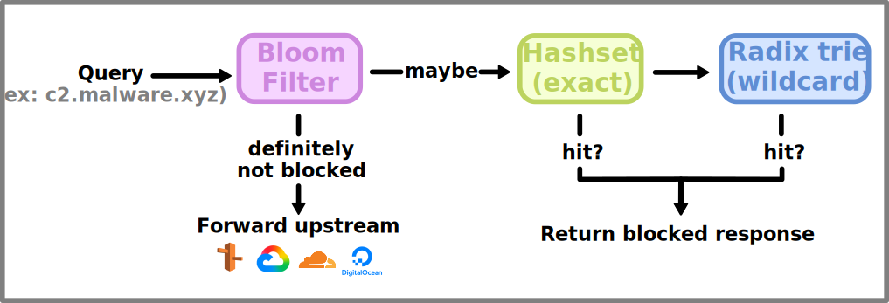

<div align="center">

# Skypier Blackhole


A fast, blocklist-driven DNS sinkhole. Ad and tracker blocking for your server or local network.

<p align="center">
  
  
  
  
  
  
</p>

</div>

Skypier Blackhole is a small DNS resolver that sits in front of your upstream
servers and drops queries for domains you don't want resolved (ads, trackers,
analytics, whatever you put on the list). Everything else is forwarded
upstream unchanged. It's meant to run next to a Skypier VPN node, but there's
nothing VPN-specific about it: point a machine or a whole network at it and it
behaves like a stripped-down Pi-hole that ships as a single binary.

It's written in Rust on top of Tokio and [Hickory DNS](https://github.com/hickory-dns/hickory-dns),
with no unsafe code. The lookup path is plain in-memory data structures, so
deciding whether a domain is blocked costs nothing compared to the network
round trip you'd otherwise pay to reach the upstream resolver.

<a href="https://asciinema.org/a/1260394" target="_blank"></a>

## Table of Contents

- [How it works](#how-it-works)
- [Installing](#installing)
  - [From source](#from-source)
  - [Debian/Ubuntu package](#debianubuntu-package)
  - [Default paths](#default-paths)
- [Getting started](#getting-started)
- [Configuration](#configuration)
  - [Blocklists](#blocklists)
  - [Automatic updates](#automatic-updates)
- [Usage](#usage)
  - [Running under systemd](#running-under-systemd)
  - [Signals](#signals)
  - [Serving a network](#serving-a-network)
- [Development](#development)
- [Troubleshooting](#troubleshooting)
- [FAQ](#faq)
- [Contributing](#contributing)
- [License](#license)
- [Acknowledgments](#acknowledgments)

## How it works

A query comes in over UDP/TCP on port 53. Before forwarding anything, the
server checks the domain against the in-memory blocklist:



The bloom filter is a cheap first pass: if it says "no", the domain is
definitely not on the list and we skip straight to forwarding. If it says
"maybe", we confirm with an exact-match hashset, then fall back to the radix
trie for wildcard rules like `*.malware.xyz`. Blocked queries never touch
the network, so they come back about as fast as the kernel can hand the packet
back to you.

Blocked domains get a configurable response. By default that's a DNS `REFUSED`,
which is the fastest thing to return. You can also send `NXDOMAIN` or hand back
a fixed IP such as `0.0.0.0` if some client misbehaves on a refusal.

For the longer version, see [doc/ARCHITECTURE.md](doc/ARCHITECTURE.md).

## Installing

The current stable release runs on Linux and macOS. Windows support is in
progress and will be released soon. The signal-based hot reload (`SIGHUP`) is
Unix only.

### From source

You'll need a recent Rust toolchain (1.70 or newer).

```bash
git clone https://github.com/SkyPierIO/skypier-blackhole.git
cd skypier-blackhole
cargo build --release
```

The binary lands at `target/release/skypier-blackhole`. On a Linux box with
systemd, a typical install looks like:

```bash
sudo cp target/release/skypier-blackhole /usr/bin/
sudo mkdir -p /etc/skypier /var/log/skypier
sudo cp config/blackhole.toml.example /etc/skypier/blackhole.toml
sudo cp systemd/skypier-blackhole.service /etc/systemd/system/
sudo systemctl daemon-reload
```

### Debian/Ubuntu package

If you'd rather not build it, grab the `.deb` from the releases page. It drops
the binary, a default config, and the systemd unit in the right places and
enables the service:

```bash
wget https://github.com/SkyPierIO/skypier-blackhole/releases/latest/download/skypier-blackhole_amd64.deb
sudo dpkg -i skypier-blackhole_amd64.deb
sudo systemctl status skypier-blackhole
```

### Default paths

The binary picks platform-appropriate paths so you don't have to pass `--config`
on every invocation:

| Platform | Config | Custom blocklist | Log |
|----------|--------|------------------|-----|
| Linux | `/etc/skypier/blackhole.toml` | `/etc/skypier/custom-blocklist.txt` | `/var/log/skypier/blackhole.log` |
| macOS | `/usr/local/etc/skypier/blackhole.toml` | `/usr/local/etc/skypier/custom-blocklist.txt` | `/usr/local/var/log/skypier/blackhole.log` |
| Windows (planned) | `C:\ProgramData\Skypier\blackhole.toml` | `C:\ProgramData\Skypier\custom-blocklist.txt` | `C:\ProgramData\Skypier\Logs\blackhole.log` |

Pass `--config /path/to/blackhole.toml` to override.

## Getting started

Point your resolver at the server, start it, and confirm it blocks what you
expect.

On a single machine, the quick version is editing `/etc/resolv.conf`:

```bash
# /etc/resolv.conf
nameserver 127.0.0.1
```

If you're on systemd-resolved, do it the supported way instead so your change
survives a reboot:

```bash
sudo mkdir -p /etc/systemd/resolved.conf.d/
cat <<'EOF' | sudo tee /etc/systemd/resolved.conf.d/skypier.conf
[Resolve]
DNS=127.0.0.1
Domains=~.
EOF
sudo systemctl restart systemd-resolved
```

Start it (either through systemd or directly), then run a query through it.
Starting it in the foreground prints the banner and begins serving:

```console
$ skypier-blackhole start

       ____  __           __    __          __
      / __ )/ /___ ______/ /__ / /_  ____  / /__
     / __  / / __ `/ ___/ //_// __ \/ __ \/ / _ \
 ___/ /_/ / / /_/ / /__/ ,<  / / / / /_/ / /  __/__
/________/_/\__,_/\___/_/|_|/_/ /_/\____/_/\______/

  Skypier Blackhole v0.1.3
  A fast, blocklist-driven DNS sinkhole

  INFO Starting DNS server...
  INFO Loaded 158432 total domains into blocklist
  INFO Update scheduler started
```

A blocked domain comes back `REFUSED`, anything else resolves normally:

```console
$ dig +short @127.0.0.1 malware.xyz
;; ->>HEADER<<- opcode: QUERY, status: REFUSED

$ dig +short @127.0.0.1 google.com
142.250.74.142
```

You don't need a running server to ask whether a domain would be blocked. The
`test` subcommand loads the same lists from disk and reports the verdict:

```console
$ skypier-blackhole test malware.xyz
Testing domain: malware.xyz

  [x] Status: BLOCKED
  [i] This domain will be blocked by the DNS server
  -> DNS queries will receive: REFUSED
```

## Configuration

Configuration is a single TOML file. The defaults that ship in
[config/blackhole.toml.example](config/blackhole.toml.example) are sensible for
a local-only resolver; the parts you'll actually touch are the listen address,
the upstream servers, and which blocklists to pull.

```toml
[server]
listen_addr = "127.0.0.1"          # "0.0.0.0" to serve a whole network
listen_port = 53
upstream_dns = ["1.1.1.1:53", "8.8.8.8:53"]  # plain DNS and/or DoH (see below)
blocked_response = "refused"       # "refused" | "nxdomain" | { ip = "0.0.0.0" }

[blocklist]
remote_lists = [
    "https://raw.githubusercontent.com/StevenBlack/hosts/master/hosts",
]
local_lists = []
custom_list = "/etc/skypier/custom-blocklist.txt"
enable_wildcards = true

[logging]
log_blocked = true
log_path = "/var/log/skypier/blackhole.log"
log_level = "info"                 # trace | debug | info | warn | error

[updater]
enabled = true
schedule = "0 0 0 * * *"           # cron (6-field, with seconds); default is daily at midnight
timezone = "EST"
update_on_start = true             # also refresh remote lists once at startup (background)
```

Full reference:

| Section | Key | Default | Notes |
|---------|-----|---------|-------|
| `server` | `listen_addr` | `127.0.0.1` | Use `0.0.0.0` to serve other machines |
| | `listen_port` | `53` | Ports below 1024 need privileges (see below) |
| | `upstream_dns` | `["1.1.1.1:53"]` | Plain `ip:port` or DoH `https://...` (see below) |
| | `blocked_response` | `refused` | `refused`, `nxdomain`, or `{ ip = "..." }` |
| `blocklist` | `remote_lists` | `[]` | URLs pulled by the updater |
| | `local_lists` | `[]` | Files loaded from disk at startup |
| | `custom_list` | `/etc/skypier/custom-blocklist.txt` | Where `add`/`remove` write |
| | `enable_wildcards` | `true` | Enables `*.domain.com` rules |
| `logging` | `log_blocked` | `true` | Log each blocked query |
| | `log_path` | `/var/log/skypier/blackhole.log` | |
| | `log_level` | `info` | |
| `updater` | `enabled` | `true` | Background auto-update |
| | `schedule` | `0 0 0 * * *` | Cron expression (6-field: sec min hour dom month dow) |
| | `timezone` | `EST` | Timezone the cron runs in |
| | `update_on_start` | `true` | Refresh remote lists once at startup (background, non-fatal) |

#### DNS over HTTPS upstreams

Upstream entries can be DoH URLs instead of plain `ip:port`, so forwarded
queries leave the box encrypted (clients still talk plain DNS to the
blackhole). The format is `https://<host>[:port][/dns-query][@bootstrap_ip[:port]]`:

```toml
upstream_dns = [
    "https://dns.quad9.net/dns-query@9.9.9.9:443",  # hostname + bootstrap IP
    "https://1.1.1.1/dns-query",                    # IP-literal host, no bootstrap
]
```

A hostname needs the `@bootstrap` suffix because there's no working resolver
yet to look it up at startup; the hostname is still used for TLS certificate
verification. The endpoint path must be `/dns-query` (the port defaults
to 443).

### Blocklists

There are three sources, all merged into one in-memory list at load time:
remote URLs that the updater downloads and caches, local files you point at,
and the custom list that the `add`/`remove` commands manage for you. The format
is the usual one domain per line, `#` starts a comment, and blank lines are
ignored. It reads StevenBlack-style hosts files and plain domain lists the
same way.

Wildcards block every subdomain but leave the apex alone, which is usually what
you want:

| Rule | Blocks | Leaves alone |
|------|--------|--------------|
| `*.example.com` | `ads.example.com`, `a.b.example.com` | `example.com` |
| `*.ads.example.com` | `x.ads.example.com` | `ads.example.com`, `example.com` |
| `exact.com` | `exact.com` | `sub.exact.com` |

A custom list looks like this:

```
# /etc/skypier/custom-blocklist.txt
ads.example.com
tracker.example.com

*.malware.xyz
*.googlesyndication.com
```

### Automatic updates

If `[updater] enabled = true`, a cron task runs inside the server, downloads
everything in `remote_lists` on schedule, writes it to a cache file next to
your custom list, and hot-reloads without dropping queries. The schedule is a
six-field cron expression (the leading field is **seconds**, as required by
`tokio-cron-scheduler`) interpreted in the configured timezone:

```
0 0 0 * * *      daily at midnight
0 0 */6 * * *    every six hours
0 0 3 * * 0      Sundays at 03:00
0 */30 * * * *   every thirty minutes
```

With `update_on_start = true` (the default), the server also kicks off a one-off
refresh as soon as it starts, so a freshly installed node doesn't wait for the
first scheduled tick to pull its remote lists. This runs in the background after
the DNS server is already serving, and a failed download is non-fatal — the
daemon falls back to the cached list and logs a warning.

You can always force a refresh by hand with `skypier-blackhole update`, and you
can turn the scheduler off entirely with `enabled = false`.

## Usage

The CLI is the same binary you run as the server. The subcommands that talk to
a running server (`stop`, `reload`, and the implicit reload after `add`,
`remove`, and `update`) find it by PID and send it a signal, so they only do
anything on Unix while the server is up.

```bash
skypier-blackhole start              # run the DNS server
skypier-blackhole stop               # graceful shutdown (SIGTERM)
skypier-blackhole reload             # hot-reload the lists (SIGHUP)
skypier-blackhole status             # process state + blocklist stats
skypier-blackhole list               # per-source domain counts
skypier-blackhole update             # pull remote lists now
skypier-blackhole test <domain>      # would this domain be blocked?
skypier-blackhole add <domain>       # append to the custom list, reload
skypier-blackhole remove <domain>    # drop from the custom list, reload
```

`add` and `remove` edit the custom list and, if the server is up, reload it on
the spot so the change is live immediately:

```console
$ skypier-blackhole add ads.example.com
Adding domain: ads.example.com

  [ok] Domain added to: /etc/skypier/custom-blocklist.txt
  [*] Reloading server...
  [ok] Server reloaded, domain is now blocked
```

`status` tells you whether the server is running and what it's serving:

```console
$ skypier-blackhole status
Skypier Blackhole Status
==================================================

  [+] Server Status: RUNNING
  [*] Process ID: 48213

  [*] Blocklist Statistics:
    - Total domains blocked: 158432
    - Custom list: /etc/skypier/custom-blocklist.txt

  [*] Configuration:
    - Listen: 127.0.0.1:53
    - Upstream DNS: 1.1.1.1:53

==================================================
```

### Running under systemd

The shipped unit handles the privileged-port capability and the signals for
you, so on a server you mostly use `systemctl`:

```bash
sudo systemctl enable --now skypier-blackhole   # start on boot and now
sudo systemctl reload skypier-blackhole         # SIGHUP, hot-reload
sudo systemctl stop skypier-blackhole           # SIGTERM, graceful
sudo journalctl -u skypier-blackhole -f         # follow the logs
```

### Signals

On Unix the server responds to three signals. `SIGHUP` rebuilds the blocklist
from disk in place; in-flight queries keep flowing and there's no window where
the server is down. `SIGTERM` and `SIGINT` (Ctrl-C) stop accepting new queries,
finish the ones already in progress, and exit cleanly.

```bash
kill -HUP  $(pgrep -f 'skypier-blackhole.*start')   # reload
kill -TERM $(pgrep -f 'skypier-blackhole.*start')   # shut down
```

`skypier-blackhole reload` and `skypier-blackhole stop` are thin wrappers around
those two. Implementation notes and test results live in
[wip/SIGNAL_HANDLING_COMPLETE.md](wip/SIGNAL_HANDLING_COMPLETE.md).

### Serving a network

To use one instance for a LAN or a VPN, set `listen_addr = "0.0.0.0"` and point
clients at the host's address. For VPN nodes you'd push it as the DNS server:

```conf
# OpenVPN server.conf
push "dhcp-option DNS 10.8.0.1"
```

```ini
# WireGuard wg0.conf
[Interface]
DNS = 10.8.0.1
```

## Development

```bash
cargo build                 # debug build
cargo build --release       # optimized build (LTO, stripped)
cargo test                  # run the test suite
cargo clippy                # lint
cargo fmt                   # format

RUST_LOG=debug cargo run -- start --config config/blackhole.toml.example
```

Source layout:

```
src/
  main.rs          entry point
  lib.rs           library exports
  cli.rs           argument parsing and subcommands
  config.rs        TOML config and platform-aware defaults
  dns.rs           the DNS server itself
  blocklist.rs     bloom filter + hashset + radix trie
  downloader.rs    remote blocklist fetching
  scheduler.rs     cron-driven auto-update
  logger.rs        tracing setup
```

## Troubleshooting

If queries aren't being answered, first confirm the server is up and actually
listening on 53:

```bash
sudo systemctl status skypier-blackhole
sudo ss -ulpn | grep :53
dig @127.0.0.1 google.com
```

A `permission denied` on startup almost always means port 53 without the
privilege to bind it. Under systemd the unit grants `CAP_NET_BIND_SERVICE`, so
this only bites when you run the binary by hand. Either run it as root for a
quick test or set `listen_port = 5353` and query that port instead.

If the lists aren't refreshing, check that `[updater]` is enabled, that the
URLs are reachable, and force an update to see the error directly:

```bash
curl -I https://raw.githubusercontent.com/StevenBlack/hosts/master/hosts
skypier-blackhole update
```

## FAQ

**How is this different from Pi-hole?** Same idea, much smaller surface. It's a
single Rust binary with no PHP, no web UI, and no external cron, and it runs on
Linux and macOS today (Windows support is in progress and will be released
soon). The tradeoff is that you configure it through a TOML file and the CLI
rather than a dashboard.

**Can I use it as a Pi-hole replacement at home?** Yes. Set
`listen_addr = "0.0.0.0"` and point your devices (or your router's DHCP DNS
setting) at the host.

**Does it do DNSSEC?** Not yet.

**Can I whitelist domains?** Not yet, that's planned. For now, remove a domain
from your lists rather than overriding it.

**Multiple upstreams?** Yes, list them in `upstream_dns`. The first one that
answers is used.

**What list formats work?** One domain per line with `#` comments, including
StevenBlack hosts files. Wildcards use the `*.domain.com` syntax.

## Contributing

Pull requests welcome. The short version: fork, branch, make the change, run
`cargo test`, `cargo clippy`, and `cargo fmt`, then open a PR. See
[CONTRIBUTING.md](CONTRIBUTING.md) for the details.

## License

Licensed under the MIT License ([LICENSE-MIT](LICENSE-MIT)).

## Acknowledgments

Built on [Hickory DNS](https://github.com/hickory-dns/hickory-dns) and Tokio.
Blocklist format and inspiration from [Pi-hole](https://pi-hole.net/) and
[StevenBlack/hosts](https://github.com/StevenBlack/hosts).
</content>
</invoke>
